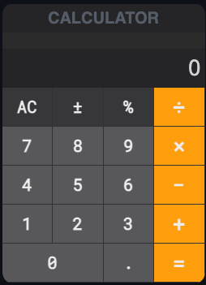

# React Calculator WebApp

## Overview

This repository contains a simple calculator web application built with React. The calculator provides basic arithmetic operations such as addition, subtraction, multiplication, division, and percentage.

## Preview

- [React Calculator - GitHub Page](https://victorfreitas.github.io/react-calculator/)

## Features

- Addition, Subtraction, Multiplication, Division, and percentage operations
- Clear and user-friendly interface

## Getting Started

### Prerequisites

To run this project, you will need to have the following installed on your machine:

- [Node.js](https://nodejs.org/en/) (version 20.12.x or later)
- [npm](https://www.npmjs.com/) (version 10.x or later) or [Yarn](https://yarnpkg.com/)

### Installation

1. Install:

   ```bash
   npm install
   ```

2. Test:

   ```bash
   npm test
   npm run test:coverage
   npm run test:watch
   ```

3. Run:

   ```bash
   npm start
   ```

4. Build:

   ```bash
   npm run build
   ```

5. Lint:

   ```bash
   npm run lint
   ```

## Screenshots



### Folder Structure

```txt
├── public
│   ├── favicon.ico
│   ├── index.html
│   ├── logo128.png
│   ├── logo512.png
│   ├── manifest.json
│   └── robots.txt
├── screenshots
├── src
│   ├── __tests__
│   │   ├── index.test.jsx
│   │   └── reportWebVitals.test.js
│   ├── apis
│   │   └── calculatorContext.js
│   ├── assets
│   │   ├── css
│   │   │   └── style.css
│   │   └── fonts
│   │       └── roboto-mono-thin.woff2
│   ├── components
│   │   ├── App
│   │   │   ├── __tests__
│   │   │   │   ├── app.test.jsx
│   │   │   │   ├── calculatorAdd.test.jsx
│   │   │   │   ├── calculatorBtnClick.test.jsx
│   │   │   │   ├── calculatorDivide.test.jsx
│   │   │   │   ├── calculatorMultiply.test.jsx
│   │   │   │   ├── calculatorPercent.test.jsx
│   │   │   │   └── calculatorSubtract.test.jsx
│   │   │   ├── index.jsx
│   │   │   └── style.module.css
│   │   ├── Button
│   │   │   ├── __tests__
│   │   │   │   └── button.test.jsx
│   │   │   ├── index.jsx
│   │   │   └── style.module.css
│   │   ├── Buttons
│   │   │   ├── __tests__
│   │   │   │   └── buttons.test.jsx
│   │   │   └── index.jsx
│   │   ├── Container
│   │   │   ├── __tests__
│   │   │   │   └── container.test.jsx
│   │   │   └── index.jsx
│   │   ├── Display
│   │   │   ├── __tests__
│   │   │   │   └── display.test.jsx
│   │   │   ├── index.jsx
│   │   │   └── style.module.css
│   │   └── Title
│   │       ├── __tests__
│   │       │   └── title.test.jsx
│   │       ├── index.jsx
│   │       └── style.module.css
│   ├── constants
│   │   ├── __tests__
│   │   │   ├── calculatorType.test.js
│   │   │   ├── event.test.js
│   │   │   └── operator.test.js
│   │   ├── calculatorType.js
│   │   ├── event.js
│   │   └── operator.js
│   ├── containers
│   │   ├── __tests__
│   │   │   └── calculator.test.js
│   │   └── calculator.js
│   ├── reducers
│   │   ├── __tests__
│   │   │   └── calculatorReducer.test.js
│   │   └── calculatorReducer.js
│   ├── utils
│   │   ├── __tests__
│   │   │   ├── calculatorInitialState.test.js
│   │   │   ├── labels.test.js
│   │   │   └── parser.test.js
│   │   ├── calculatorInitialState.js
│   │   ├── labels.js
│   │   └── parser.js
│   ├── index.jsx
│   ├── reportWebVitals.js
│   └── setupTests.js
├── README.md
├── package-lock.json
└── package.json
```
